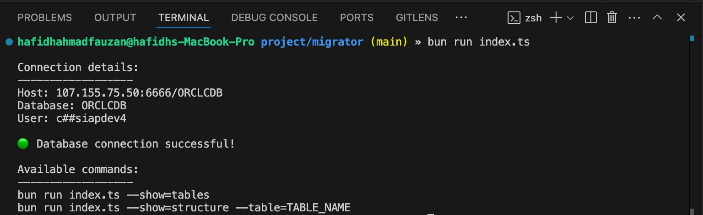
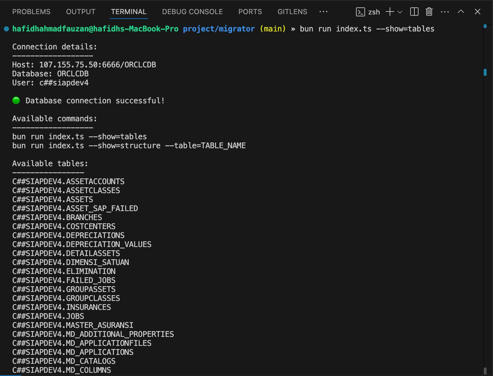

# Database Connection Tool

A command-line tool to connect to Oracle Database and explore tables.

## Setup

1. Copy the environment file:
```bash
cp .env.example .env
```

2. Update the `.env` file with your database credentials:
```env
DB_USER="your_oracle_username"
DB_PASSWORD="your_oracle_password"
DB_CONNECT_STRING="host:port/service_name"
```

## Usage

Test connection:
```bash
bun run index.ts
```

Show all tables:
```bash
bun run index.ts --show=tables
```

Show table structure:
```bash
bun run index.ts --show=structure --table=TABLE_NAME
```

Show all table relationships:
```bash
bun run index.ts --show=relations
```

Show relationships for specific table:
```bash
bun run index.ts --show=relations --table=TABLE_NAME
```

## Installation

1. Install dependencies:
```bash
bun i oracledb @types/oracledb dotenv
```

## Example Outputs

### Check Connection


### Show Tables


### Show Table Structure


## Security Note
- `.env` file containing your actual database credentials is ignored by git
- Never commit sensitive credentials to version control
